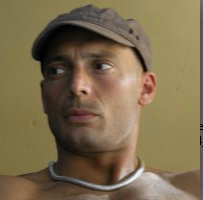

# Fabio Lonegro

  

    
  

  

    📧 Email: <a href="mailto:fabiolune@gmail.com">fabiolune@gmail.com</a> 
    📞 Phone: <a href="callto://+39 3405414594">+39 3405414594</a> 
    🌐 LinkedIn: <a href="https://www.linkedin.com/in/fabio-lonegro-phd-9493278">fabio lonegro</a> 
    🌐 GitHub: <a href="https://github.com/fabiolune"fabiolune>fabiolune</a>
  

> I have a deep-seated enthusiasm for technology and a track record of several years in crafting comprehensive solutions. My primary goal is to deliver substantial value to clients and end users, with a particular focus on enhancing performance, ensuring scalability, fortifying security, and managing costs efficiently.

***

## Professional experience

### Technical Director/Cloud architect - Deltatre spa (2012 - )

During the last 10 years, I worked in the role of senior Developer, then Tech Lead, Technical Product Owner, and finally Technical Director.

#### Key responsibilities

* design complex event-driven, highly scalable cloud software architectures
* promote and ensure the adoption of clean code, security, and DevOps best practices
* lead a team of highly skilled engineers, providing guidance and context, and ensuring best practices adoption
* lead transition to fully kubernetes/microservices oriented architectures
* set team goals and support their achievement

#### Main technology stack

* TDD and DDD
* Kubernetes
* Docker
* .net
* functional and OOP programming
* NoSQL and in memory stores
* nodeJS
* Azure and AWS cloud
* Serverless
* Golang

#### Main Projects

* _BeIN Connect_
* _NFL Game Pass_
* _Fox sports NL_
* _Fox Soccer Match Pass_
* _FINA TV_
* many consultancies to provide technical orientation for big clients projects (_Olympics Broadcasting System_, _NHK Olympics_, _Discovery Golf TV_, _Direct TV_, _Liberty Global_, _Juventus Pass_,  ...)

In my role as a technical guide for OTT (Over-The-Top) solutions, I have been responsible for providing comprehensive guidance across all facets of OTT technology. This encompassed a range of critical responsibilities, including:

* __Strategic Consultation__: Advising clients on OTT strategies tailored to their specific needs and objectives. This involved understanding their target audience, content delivery requirements, and business goals.

* __Content Delivery Optimization__: Implementing and fine-tuning OTT delivery mechanisms to ensure seamless streaming experiences for end users. This included optimizing content delivery networks (CDNs), adaptive streaming protocols, and Quality of Service (QoS) parameters.

* __Scalability Planning__: Assessing and planning for the scalability needs of OTT platforms to accommodate increasing user demands. This entailed evaluating server infrastructure, load balancing, and auto-scaling solutions.

* __Security Measures__: Ensuring robust security protocols were in place to protect against content piracy, unauthorized access, and data breaches. Implementing DRM (Digital Rights Management) solutions and encryption methods were integral parts of this aspect.

* __Cost Management__: Developing cost-effective strategies to balance the demands of high-quality streaming with cost control. This included optimizing server usage, bandwidth allocation, and resource allocation.

* __User Experience Enhancement__: Collaborating with UX/UI teams to enhance the user interface and overall experience of OTT platforms, striving for user-friendliness and viewer engagement.

* __Analytics and Performance Monitoring__: Implementing tools and methodologies to track user behavior, assess platform performance, and gather valuable data for further refinement and decision-making.

* __Subscription and Payment Integration__: Collaborating closely with payment service providers and subscription management platforms to seamlessly integrate payment gateways, billing cycles, and subscription models into OTT solutions. Ensuring a frictionless user experience for subscription sign-ups, renewals, and payment processing while maintaining data security and compliance with relevant regulations.

***

### Project Lead - E-Mentor srl (2010 - 2012)

E-Mentor is a small company focusing on highly customized e-learning platform solutions.

#### Key responsibilities

* drive the innovation change (more structured software development life cycle)
* best practices adoption
* assets standardization
* provide solutions for huge data sets analysis and processing

#### Main technology stack

* PHP
* Java
* Javascript
* SQL

***

### Project Lead - Must srl (2008 - 2010)

MUST is a small company focusing on the production of e-learning products.

#### Key responsibilities

* Instructional design
* Development of assessment modules

#### Main technology stack

* PHP
* Java
* Javascript
* SQL

## Education and training

* PhD in Theoretical physics: _Turin University_, 2001-2005
* Master's degree in Physics: _Turin University_, 1996-2001

## Languages

* Italian - mother tongue
* English - fluent
* (Brazilian) Portuguese - fluent
* French - advanced

## Personal interests

In my personal life I am a proud father, I like traveling and reading.

I am a Capoeira (almost-)master, with 20+ years of experience.

During my off-hours, I find pleasure in reading and actively work on personal projects that allow me to experiment with and delve into emerging technologies.
